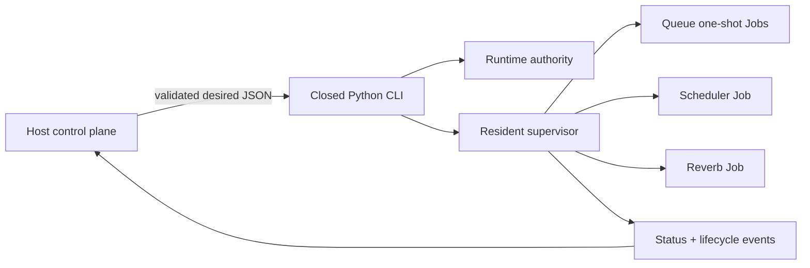
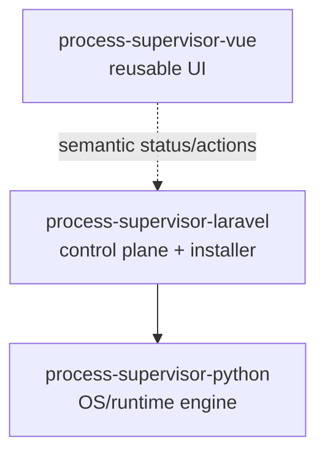

# process-supervisor-python

Windows-first process supervision engine for the Process Supervisor family.

This repository contains the operating-system/runtime layer only. It does not know about Laravel HTTP routes, application users, Inertia, Vue, database settings, or authorization. A host control plane translates product intent into a validated desired-state document and calls the closed Python CLI.

## What it does

`process-supervisor-python` owns the lifecycle of exact process trees for three workload kinds currently used by the Laravel integration:

- Queue one-shot workers
- Scheduler invocations
- Reverb

The engine persists desired/runtime authority, reconciles a resident supervisor process, uses Windows Job Objects for exact ownership, applies bounded restart/backoff rules, and provides fail-closed recovery when authority becomes inconsistent.



## Install for development

The package supports Python 3.10+. The declared minimum was validated with the complete test suite on CPython 3.10.20.

With `uv`:

```bash
uv venv .venv
uv pip install --python .venv/Scripts/python.exe -e .
```

On Unix-like systems the Python path is normally `.venv/bin/python`.

The distribution name and console command are `process-supervisor-python`. The internal Python module remains `py_laravel_supervisor` for compatibility.

```bash
process-supervisor-python doctor --runtime-root ./runtime
```

The current v1 runtime is intentionally Windows-first. `doctor` fails closed on unsupported hosts.

## Closed CLI

The engine accepts a deliberately small command set:

```text
process-supervisor-python doctor
process-supervisor-python apply-desired
process-supervisor-python disable-gate
process-supervisor-python ensure-running
process-supervisor-python status
process-supervisor-python shutdown
process-supervisor-python recover
```

There is no arbitrary `exec`, arbitrary argv, arbitrary cwd, or arbitrary environment command surface.

## Security and authority model

The most important rule is: **PID is informational; ownership is Job-based**.

The supervisor does not treat “a process with this PID” as sufficient proof that it owns something. It records exact Windows Job Object ownership and lifecycle identity. Destructive cleanup is allowed only when that authority can be resolved safely.

The engine also deliberately does **not** persist raw stdout/stderr tails. Pipe output is drained to avoid deadlocks and Queue JSON protocol data is classified in memory, but operational persistence is limited to sanitized status/events. Host applications should use their diagnostics system for operator-facing failure history.

## Documentation

Start here if you know very little about the implementation:

1. [`z-docs/00-mental-model.md`](z-docs/00-mental-model.md) — plain-language mental model
2. [`z-docs/01-architecture.md`](z-docs/01-architecture.md) — components and authority flow
3. [`z-docs/02-process-lifecycle.md`](z-docs/02-process-lifecycle.md) — resident, slots and workload lifecycle
4. [`z-docs/03-recovery-and-safety.md`](z-docs/03-recovery-and-safety.md) — recovery, backups and fail-closed behavior
5. [`z-docs/04-workload-kinds.md`](z-docs/04-workload-kinds.md) — Queue, Scheduler and Reverb
6. [`z-docs/05-operations-and-testing.md`](z-docs/05-operations-and-testing.md) — CLI, states, testing and troubleshooting

## Package family



The Laravel and Vue packages are consumers. The Python engine remains independently testable and installable.