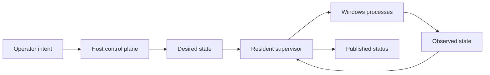
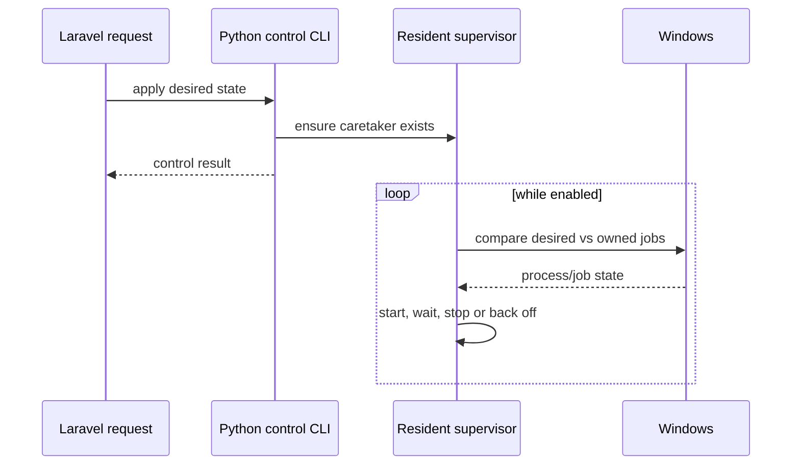
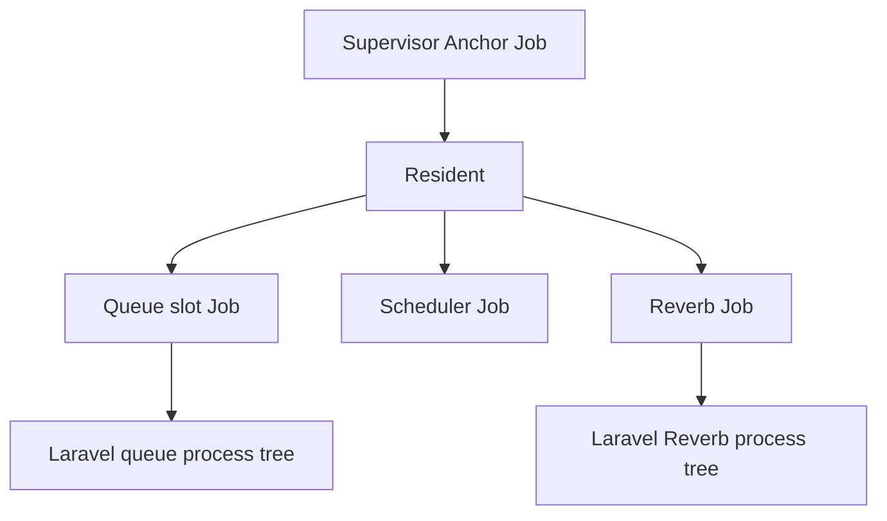
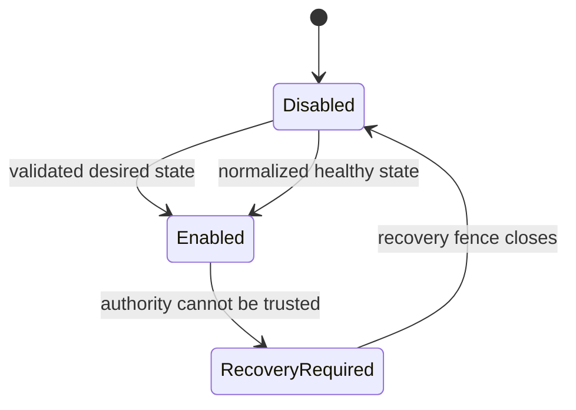

# 00 — Mental model: what this supervisor actually does

This chapter assumes almost no prior knowledge of process supervision.

## The problem in one sentence

A web application can ask the operating system to start Queue workers, a Scheduler process or Reverb, but once those processes exist somebody must remember **what should be running, what really is running, and which processes it is safe to stop**.

That somebody is the Process Supervisor.

## Desired state versus observed state

The supervisor does not treat a Start button as “run this command and forget about it”. The host writes a **desired state** such as:

- Queue: 3 worker slots
- Scheduler: enabled according to its cron
- Reverb: 1 process

The resident supervisor continuously compares that desired state with the state it observes.

A Stop action therefore means “change the desired state to zero and reconcile safely”, not “find a PID and kill it”.

## Why there is a resident process

A normal HTTP request is short-lived. Queue/Reverb supervision is long-lived. A small resident Python process remains alive after the request finishes and performs reconciliation.

## Why Job Objects matter

PIDs can be reused and child processes can create additional processes. The supervisor therefore treats a Windows **Job Object** as the ownership boundary.

A Job Object groups the process tree the supervisor owns. This allows cleanup to mean “terminate exactly this owned Job” instead of “kill process 1234 and hope it is still ours”.

## What is persisted

The runtime directory stores small JSON authority files. Their purpose is not “logging everything”; their purpose is letting a new control request understand the state left by previous requests/processes.

Conceptually the important pieces are:

- immutable runtime owner identity
- desired state
- spawn gate
- resident lifecycle ledger
- child lifecycle ledgers
- published status
- sanitized lifecycle events
- last-known-good backups for recoverable authority files

Raw process output is deliberately **not** persisted by this engine.

## The spawn gate

The spawn gate is a safety fence.

When recovery is required, normal Start/Restart operations are blocked. Recovery first closes the gate so nothing can spawn while authority is being repaired.

## What “recovery required” means

It does not necessarily mean a child process crashed. It means the supervisor cannot safely prove enough of its control-plane state to continue normal mutations.

Examples:

- authority JSON is corrupt
- a lifecycle ledger is uncertain
- a previous resident disappeared unexpectedly
- persisted identity and current installation disagree

The safe answer is to stop creating new processes until exact ownership and authority are reconciled.

## The key takeaway

> The supervisor is a desired-state machine with exact Windows ownership. It starts or stops only what it can prove belongs to the runtime, and it refuses risky recovery when that proof is missing.