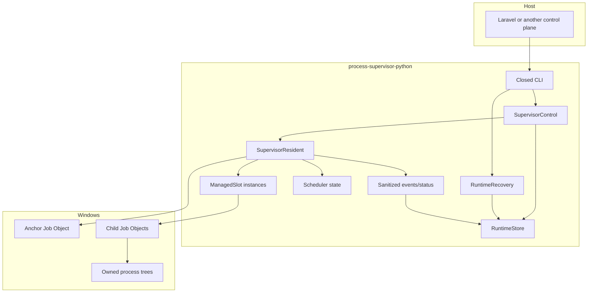
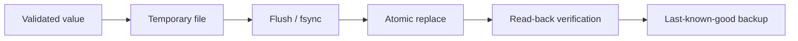
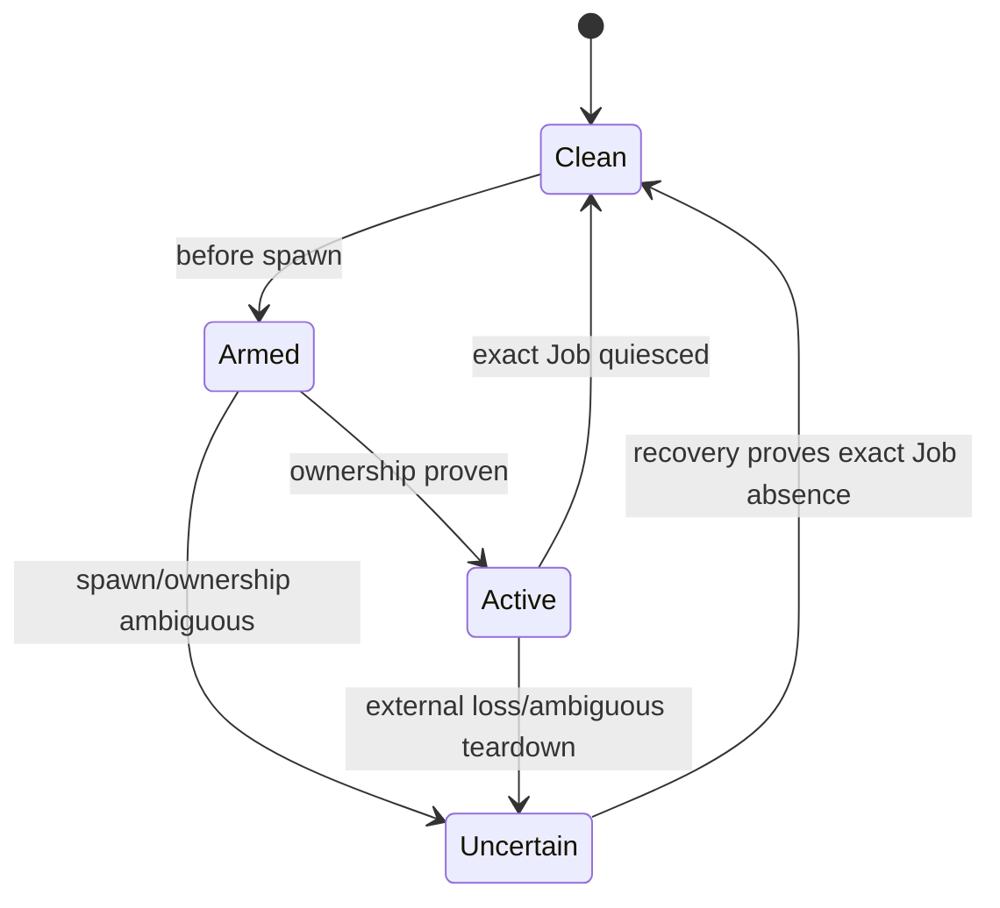
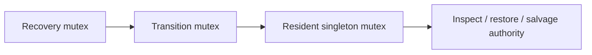

# 01 — Architecture

This chapter adds the main implementation pieces without going deep into Win32 API details.

## High-level components

## Closed CLI

`cli.py` translates a fixed command name into a fixed control operation. The host may submit validated desired JSON to `apply-desired`, but it may not submit arbitrary commands to execute.

This is important because the Python layer is close to the operating system. Keeping the public surface small makes the security model understandable.

## RuntimeStore

`RuntimeStore` owns JSON persistence rules:

- atomic temp-file replacement
- schema and installation identity checks
- last-known-good backups
- immutable runtime owner identity
- authority archive during salvage

A successful write is therefore more than a simple file write.

## SupervisorControl

`SupervisorControl` handles short-lived control operations:

- apply desired state
- close the spawn gate
- ensure the resident exists
- read status
- shutdown
- enter recovery

It uses a transition mutex so two control requests cannot freely interleave state mutations.

## SupervisorResident

The resident owns the long-running reconciliation loop. It reads current desired state and maintains the required slots.

The resident is not product authority. If desired state says zero, it converges to zero. It does not invent capacity by itself.

## ManagedSlot

A slot represents one supervised child unit. Queue desired capacity 3 means three Queue slots.

A slot owns:

- one exact child Job Object
- child lifecycle ledger
- restart/backoff state
- Queue completion classifier when relevant
- watchdog/stop deadlines

Healthy Queue one-shot recycling is deliberately different from crash restart accounting.

## Lifecycle ledgers

Resident and children use lifecycle ledgers to record whether ownership is clean, armed, active or uncertain.

An uncertain ledger is not casually discarded: it represents unresolved destructive authority.

## Recovery mutex hierarchy

Recovery authority repair is fenced so two repairs cannot archive/delete/recreate state concurrently.

The important rule is that destructive authority repair happens only inside the serialized boundary and only after a live resident cannot still mutate the same authority concurrently.

## Data authority and OS authority

There are two kinds of truth and they must agree:

- **data authority**: desired/gate/ledger/status JSON
- **OS authority**: exact named Job Objects and their process trees

Recovery is correct only if it reasons about both. Deleting a corrupt JSON file is not enough if the corresponding exact Job might still be alive.

## Architecture rule of thumb

If a future feature requires arbitrary shell execution, arbitrary environment injection, PID-based ownership or deleting lifecycle evidence before exact Job absence is known, it is outside the current safety model and should be redesigned rather than bolted onto the engine.