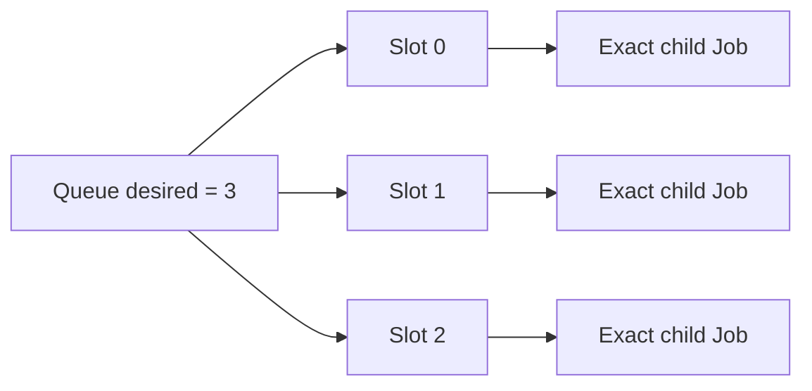
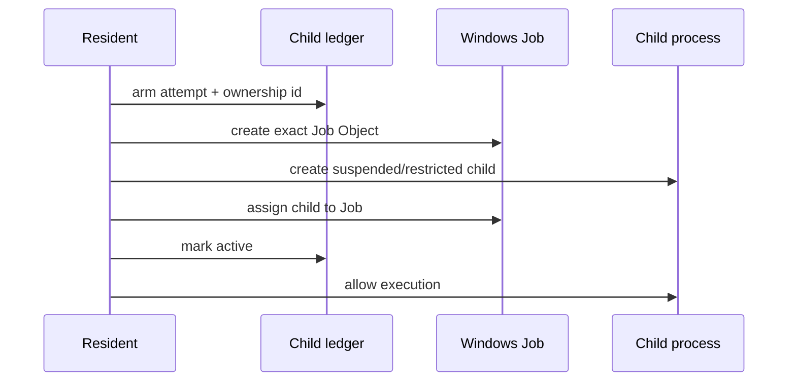
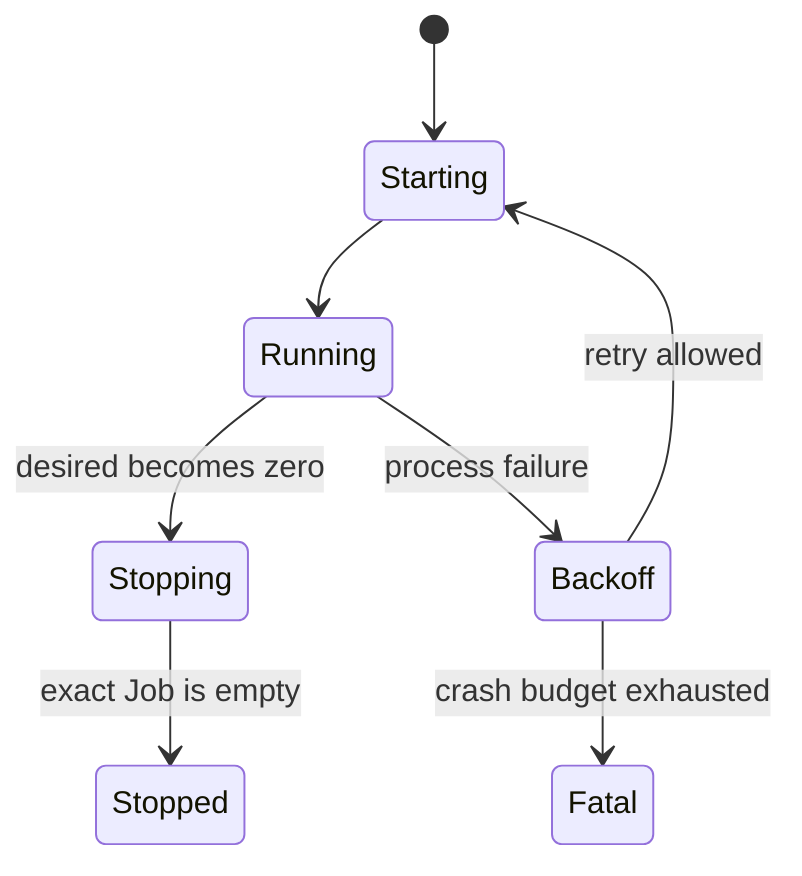
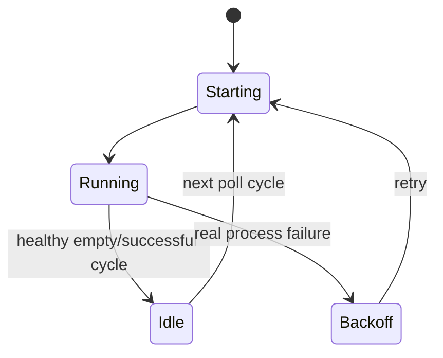
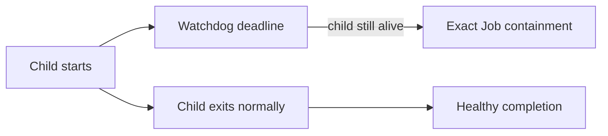

# 02 — Process lifecycle

This chapter explains how a desired process becomes an owned process and how it returns to a clean state.

## From desired capacity to slots

The host describes groups and desired capacity. The resident expands that into slots.

A slot is not just a PID. It combines lifecycle authority, restart history, deadlines and the exact Job Object that contains the child process tree.

## Spawn flow

The lifecycle is write-ahead. The supervisor records its intent before process creation, then proves ownership after spawn.

If the sequence becomes ambiguous, the ledger becomes `uncertain` rather than pretending the child is clean.

## Running and stopping

For a long-lived workload such as Reverb, the normal path is:

The stop deadline gives the child an opportunity to exit cooperatively. If it does not, the supervisor may terminate only the exact Job it owns.

## Queue one-shot recycling

Queue is different because `queue:work --once` is expected to exit after one bounded cycle.

A healthy exit is not a crash.

The distinction matters operationally:

- healthy recycle keeps `restart_count = 0`
- crash backoff increments restart accounting
- `idle` is healthy capacity, not a warning state

When the queue is empty, the next one-shot spawn is delayed using the configured sleep interval instead of respawning in a tight loop.

## Watchdogs

Some Laravel worker semantics normally depend on Unix process-control features. The Windows-first engine therefore uses external watchdogs for bounded child lifetime.

A watchdog failure is a process-health signal. It is different from an application-level job failure handled normally by Laravel.

## Resident heartbeat

The resident periodically publishes status/heartbeat. A host can treat a stale heartbeat with active desired capacity as a control-plane failure even if the last JSON status still says `running`.

This prevents stale “green” state from surviving an externally terminated resident.

## Generation changes

Some configuration changes alter the actual process contract: PHP executable, child environment, port or group parameters. Those changes advance group/runtime generation so the resident replaces old instances instead of silently continuing with stale configuration.

## Clean shutdown invariant

A slot is truly clean only after both conditions hold:

1. the lifecycle ledger no longer claims active/uncertain ownership;
2. the exact Job Object is proven empty/absent.

This is why process cleanup is more strict than merely observing an exit code.