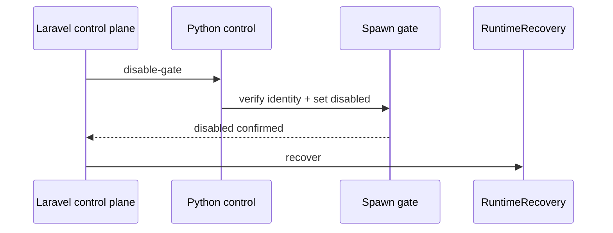
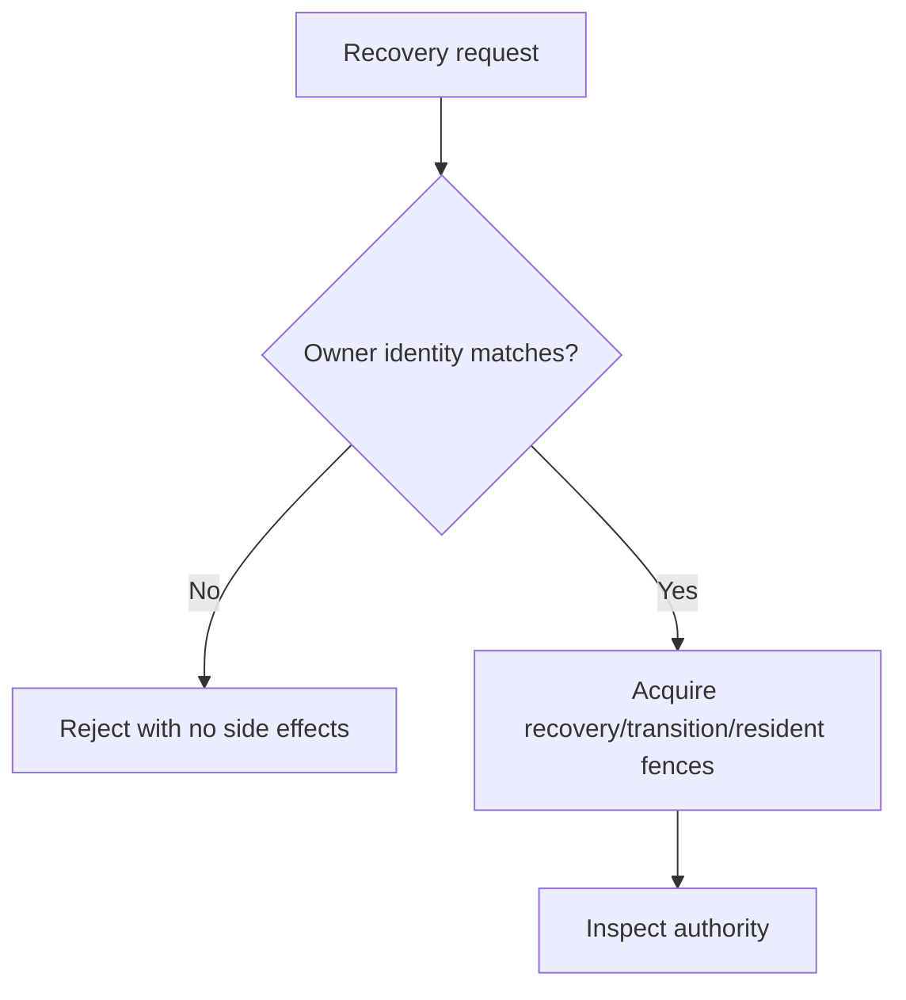
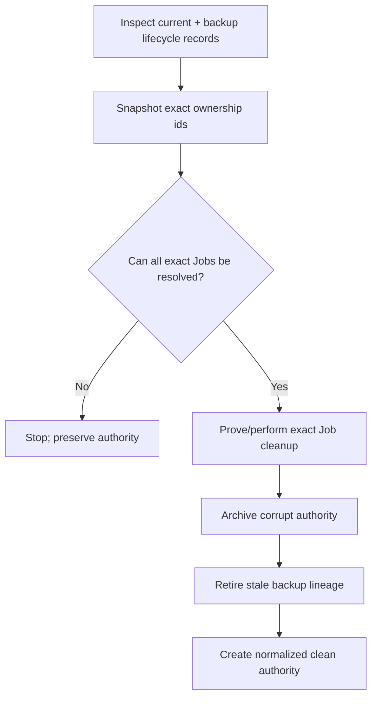
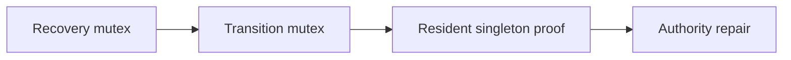

# 03 — Recovery and safety

Recovery is the most safety-sensitive part of the engine. Its purpose is not “make the error disappear”; its purpose is to restore a state in which future process mutations are trustworthy.

## Why recovery exists

Authority may become inconsistent after events such as:

- abrupt host/process termination
- partially written or externally corrupted files
- an uncertain spawn attempt
- a resident disappearing while children may still exist
- an installation identity mismatch

The engine responds by blocking normal spawning and requiring an explicit recovery path.

## Recovery starts by closing the spawn fence

The Laravel integration first calls the closed `disable-gate` operation. This operation can close the gate without reading/replacing a corrupt `desired.json`.

If the closed gate cannot be proven, the repair does not continue.

## Immutable runtime owner

`runtime-owner.json` provides a stable installation identity independent of other authority files.

A foreign installation cannot take over an existing runtime by passing a different installation id to recovery.

When recovery is refused because identity or a live resident cannot be safely resolved, authority is expected to remain byte-for-byte untouched.

## Last-known-good backups

Selected authority files are written atomically and verified. After a verified write, a last-known-good copy is maintained.

On recovery:

- a corrupt primary may be restored from a valid identity-matched backup;
- a corrupt backup is not trusted;
- a backup for another installation is not trusted.

Backups are an aid to recovery, not a way to bypass identity checks.

## Lifecycle ownership is stricter than normal JSON state

A corrupt status file can often be reconstructed. A corrupt lifecycle ledger is more dangerous because it may be the only record of an exact Job Object that still exists.

Therefore:

> corrupt lifecycle ownership without a valid backup is fail-closed.

The engine will not erase that evidence and claim the runtime is clean.

## Snapshot ownership before salvage

Before destructive salvage, recovery snapshots every valid resident/child lifecycle ownership record.

This ordering prevents a corrupt unrelated file from causing recovery to delete the only lifecycle evidence before checking live Jobs.

## Authority archive and backup retirement

When full salvage is allowed, old authority is archived under a timestamped `corrupt/` directory for diagnostics.

Old last-known-good lineage is retired as part of salvage. Otherwise a second recovery could restore a pre-salvage desired state or child ledger and “resurrect” stale capacity.

## Concurrency

Recovery uses a fixed mutex order and rechecks the resident inside the serialized boundary. The goal is to prevent two recoveries from simultaneously restoring/archiving/deleting the same authority.

A recovery that cannot obtain the required ownership boundary fails rather than racing.

## What a successful recovery means

At engine level, successful recovery means authority is structurally valid and exact ownership is reconciled. The Laravel control plane then publishes a normalized desired state using **current** product availability and zero desired capacity for every group.

This prevents recovery from accidentally restarting previously active Queue/Reverb capacity.

## Recovery is deliberately conservative

Some corrupt states are recoverable; some are not. A refusal is a valid safety result.

The engine prefers:

- explicit recovery required
- preserved evidence
- no new spawns

instead of guessing ownership and risking termination of an unrelated process tree.