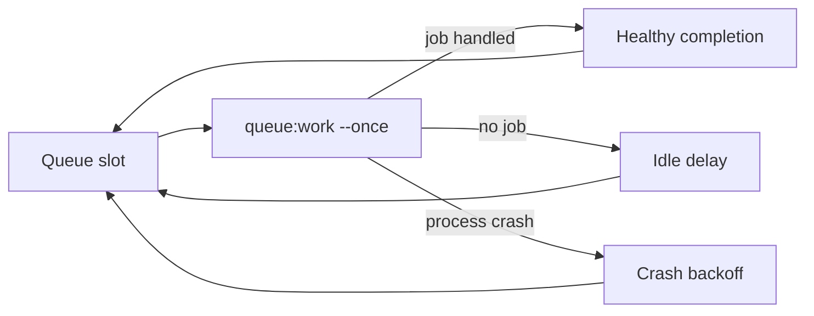
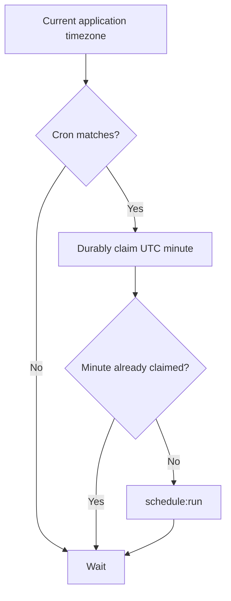
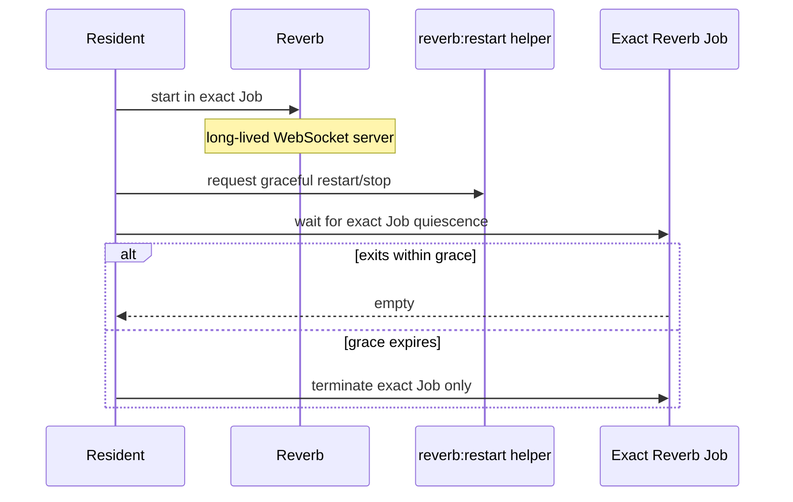

# 04 — Queue, Scheduler and Reverb

The engine supports a small set of workload kinds. They share the same exact-ownership model but have different lifecycle semantics.

## Queue one-shot workers

Queue uses bounded one-shot Laravel workers rather than a permanently running `queue:work` process.

Conceptually:

```text
php artisan queue:work <connection> --once --json ...
```

The exact argv is built from the validated manifest; it is not supplied by the browser.



The JSON worker protocol is consumed in memory so the engine can distinguish Laravel/application outcomes from process failures. Raw worker output is not persisted.

### Why one-shot?

It creates a clear process boundary for:

- external watchdogs
- exact Job cleanup
- restart accounting
- graceful desired-capacity changes

A valid failed/released Laravel job is not automatically a supervisor process crash.

## Scheduler

Scheduler is also one-shot. The resident evaluates a numeric five-field cron expression and runs Laravel `schedule:run` at the matching minute.



Important behavior:

- the application timezone is authoritative;
- the current UTC minute is claimed durably;
- the same scheduler slot does not overlap itself;
- a resident restart in the same claimed minute does not duplicate the run;
- missed minutes are intentionally not backfilled.

## Reverb

Reverb is a long-lived workload.

The child command is Laravel-owned/configured, but lifecycle ownership belongs to the supervisor Job.



Helper command success is never considered proof that the target process exited. Exact Job quiescence is the authority.

## Port conflicts

Port availability is normally preflighted by the Laravel control plane before asking Python to start Reverb. This prevents a predictable port conflict from entering an unnecessary crash/restart loop.

## PHP executable contract

Laravel-managed workloads require a **verified PHP CLI binary**.

A web-SAPI executable such as `php-cgi.exe` is not accepted as a substitute. This matters on Windows development stacks where the PHP process serving the HTTP request may itself be CGI/FastCGI.

## Shared rules across workload kinds

All workload kinds share these invariants:

- validated fixed command shape
- allowlisted non-secret child environment
- exact Job ownership
- write-ahead lifecycle authority
- bounded stop/watchdog behavior
- sanitized status/events only
- recovery required on ambiguous destructive authority