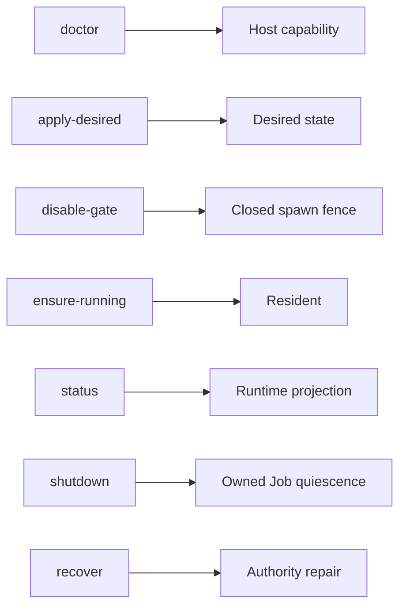
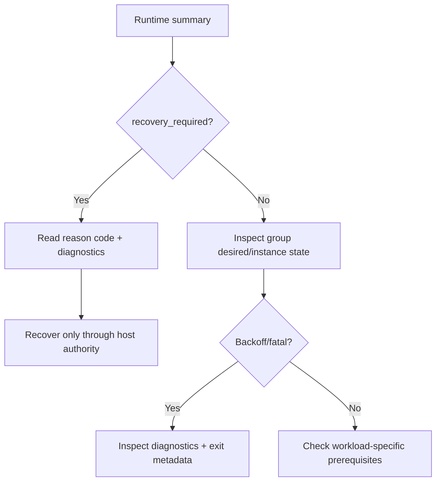

# 05 — Operations, states and testing

This chapter is a practical map for operators and contributors.

## Runtime states

At a high level the runtime may report states such as:

- `stopped` — healthy but no active managed capacity
- `starting` — convergence is in progress
- `ready` — desired active capacity is healthy
- `degraded` — one or more groups are unhealthy but authority is still usable
- `recovery_required` — normal mutations are blocked until authority is repaired

Instances may additionally be `running`, `idle`, `stopping`, `backoff`, `fatal` or `uncertain`.

`idle` is especially important for Queue: it means the one-shot slot is healthy and waiting for its next cycle.

## CLI operations

The control CLI is machine-oriented JSON.



For human/application operations, the Laravel package provides the higher-level `process-supervisor:control` command.

## Diagnostics instead of process-output tails

The engine no longer persists live process output tails.

This is intentional:

- stdout/stderr is drained so children cannot deadlock on full pipes;
- Queue protocol lines are interpreted in memory;
- status/events persist allowlisted metadata only;
- operator-facing history should be recorded by the host diagnostics system.

This keeps runtime authority small and avoids turning process output into another sensitive persistence channel.

## Troubleshooting order

When something is wrong, inspect in this order:



Do not start by killing PIDs or deleting authority files manually. Those actions destroy the evidence recovery uses to prove ownership.

## Testing philosophy

Most tests use isolated temporary runtime roots and unique Job names. This lets the suite exercise real ownership logic without touching the application’s user runtime.

The major test layers are:

- contract/schema tests
- runtime file atomicity/LKG tests
- lifecycle ledger tests
- slot/Job behavior tests
- resident reconciliation tests
- recovery/concurrency tests
- scheduler timezone/claim tests
- output-secrecy tests

A real Reverb smoke belongs at the integration layer and should be explicit opt-in because it starts an actual listener/process tree.

## Running tests

From the package repository with an environment containing its dependencies:

```bash
python -m unittest discover -s tests -p "test_*.py"
python -m compileall -q src tests
```

The Laravel package installer creates a dedicated application venv and runs the Python `doctor` as part of synchronization.

## Contributor checklist

Before changing lifecycle/recovery code, ask:

1. Does this preserve exact Job ownership?
2. Can a failure occur between writing intent and proving ownership?
3. Is that failure represented as `uncertain` rather than guessed clean?
4. Can recovery refuse without mutating bytes when authority is not provable?
5. Are current and backup authority both considered?
6. Could a second recovery resurrect stale state?
7. Does the test use an isolated runtime and bounded exact cleanup?

If any answer is unclear, the change is not ready for production use.